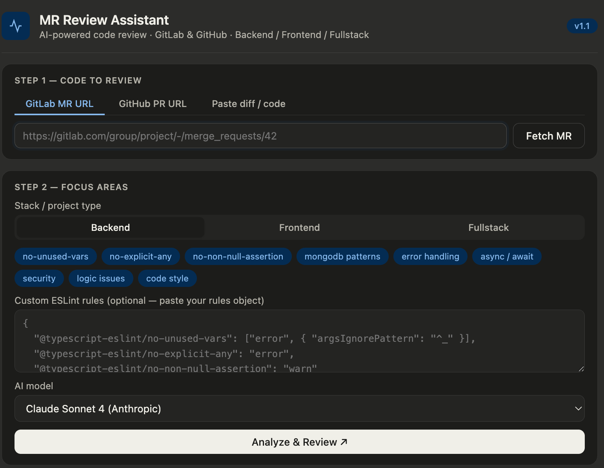
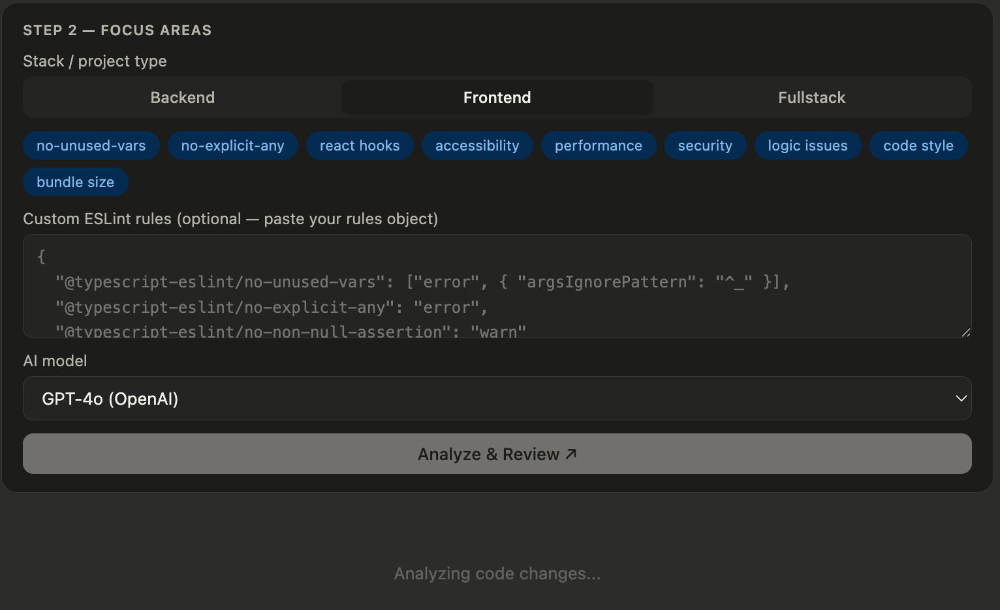
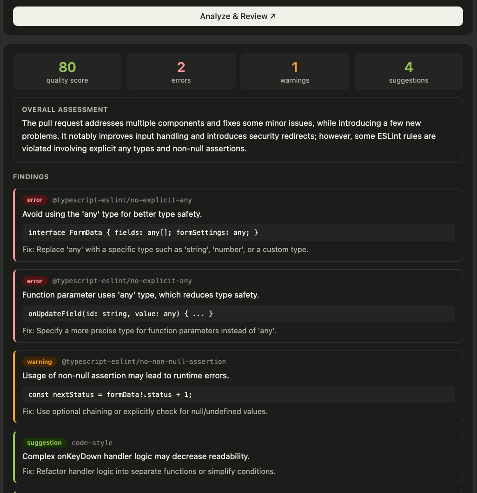

# MR Review Assistant

> AI-powered merge request / pull request code reviewer for GitLab & GitHub — supports Backend, Frontend, and Fullstack projects.


---

## What it does

Paste a GitLab MR or GitHub PR URL → get an instant AI-powered code review tailored to your stack. Select **Backend**, **Frontend**, or **Fullstack** and the reviewer's focus areas switch automatically.

### Backend
- **ESLint violations** — `no-explicit-any`, `no-unused-vars`, `no-non-null-assertion`, etc.
- **MongoDB anti-patterns** — missing `.lean()`, missing `await` on queries, no error handling, missing projections
- **Async/await bugs** — unhandled promises, missing `try/catch`, fire-and-forget DB calls
- **Security** — hardcoded secrets, NoSQL injection, unvalidated inputs

### Frontend
- **React hooks rules** — missing `useEffect` deps, stale closures, conditional hook calls
- **Component patterns** — missing `key` props, unnecessary re-renders, components defined inside render
- **Accessibility** — missing `alt` text, `aria-*` attributes, keyboard navigation, non-semantic HTML
- **Bundle size** — whole-library imports, missing route-level lazy loading
- **Security** — `dangerouslySetInnerHTML` without sanitization, open redirects

### All stacks
- TypeScript type safety, logic bugs, code style violations, security issues

Choose your preferred AI model (Claude, GPT-4o, or Grok) and after reviewing, **auto-post the result as a comment** directly on your GitLab MR or GitHub PR.

---

## Screenshots

### Step 1 — Input & Step 2 — Stack selector (Backend)


### Step 2 — Frontend stack selected


### Review results


### Post comment to GitLab


---

## Getting started

### Requirements

- Node.js **≥ 18.0.0** (uses built-in `fetch`)

### Setup

```bash
# 1. Clone the repo
git clone https://github.com/PriyamSengupta/mr-review-assistant.git
cd mr-review-assistant

# 2. Install dependencies
npm install

# 3. Configure your keys
cp .env.example .env
# Edit .env — add at least one LLM key and the tokens for your platform(s)

# 4. Start the server
npm start
```

Open **http://localhost:3000** in your browser.

> **Dev mode** (auto-restarts on file change):
> ```bash
> npm run dev
> ```

---

## Configuration (.env)

Copy `.env.example` to `.env` and fill in your values. This file is gitignored and never committed.

### LLM providers — configure at least one

| Key | Model | Free credits | Where to get it |
|-----|-------|-------------|----------------|
| `ANTHROPIC_API_KEY` | Claude Sonnet 4 | $5 for new accounts | [console.anthropic.com/settings/keys](https://console.anthropic.com/settings/keys) |
| `OPENAI_API_KEY` | GPT-4o | $5 for new accounts | [platform.openai.com/api-keys](https://platform.openai.com/api-keys) |
| `XAI_API_KEY` | Grok 3 Mini | $25/month free | [console.x.ai](https://console.x.ai) |
| `GEMINI_API_KEY` | Gemini 2.0 Flash Lite | Requires billing | [aistudio.google.com/app/apikey](https://aistudio.google.com/app/apikey) |

> Set at least one key. Providers without a key are greyed out in the UI. If a call fails (quota exceeded, insufficient credits, etc.), the error message from the API is shown directly in the UI.

### Source control tokens

| Key | Scope | Where to get it |
|-----|-------|----------------|
| `GITHUB_TOKEN` | `repo` | [github.com/settings/tokens](https://github.com/settings/tokens) |
| `GITLAB_TOKEN` | `api` | [gitlab.com/-/user_settings/personal_access_tokens](https://gitlab.com/-/user_settings/personal_access_tokens) |
| `GITLAB_HOST` | — | Your GitLab instance URL (default: `https://gitlab.com`) |

> All keys live only in `.env` on your machine. They are never sent to the browser.

---

## Supported AI models

The UI shows only the models you have configured. Unconfigured providers are greyed out.

| Provider | Model | Notes |
|----------|-------|-------|
| **Anthropic** | `claude-sonnet-4-20250514` | Default |
| **OpenAI** | `gpt-4o` | Uses `response_format: json_object` |
| **xAI** | `grok-3-mini` | $25/month free for new accounts |
| **Google** | `gemini-2.0-flash-lite` | Requires billing on Google Cloud project |

To change a model version, edit the relevant file in `llm/`.

---

## Usage

### Step 1 — Paste your MR / PR URL

**GitLab MR:**
```
https://gitlab.com/your-group/your-project/-/merge_requests/42
```
Click **Fetch MR** — loads the title, author, branch info, and full diff automatically.

**GitHub PR:**
```
https://github.com/owner/repo/pull/42
```
Click **Fetch PR** — same experience, using the GitHub REST API.

Alternatively, switch to **Paste diff / code** tab and paste a raw git diff or file contents directly.

### Step 2 — Stack, focus areas, model & review

- **Select your stack** — Backend, Frontend, or Fullstack. The focus-area chips update automatically to match the stack's relevant rules.
- Toggle individual chips on/off to narrow or expand the review scope
- Optionally paste a custom ESLint rules object to override the defaults
- Select your AI model from the dropdown (only configured models are enabled)
- Click **Analyze & Review**

Once results appear, click **Post comment on MR / PR** to push the review directly to GitLab or GitHub as a formatted markdown comment.

---

## Sample comment output

```markdown
## ⚠️ AI Code Review — Score: 61/100

> The MR introduces a user deletion endpoint but has several issues...

### Findings

🔴 [no-explicit-any] Parameter `data` is typed as `any` — loses all type safety.
> 💡 Replace with a proper interface: `data: DeleteUserPayload`

🔴 [error-handling] `User.findByIdAndDelete()` is called without `await` and has no try/catch.
```
async function deleteUser(id) {
  User.findByIdAndDelete(id)   // ← missing await + no error handling
}
```
> 💡 Wrap in try/catch and await the call.

🟡 [mongodb-patterns] `.find()` returns full Mongoose documents. Use `.lean()` for read-only queries.
```

---

## Customizing ESLint rules

In **Step 2**, paste your own ESLint rules JSON to override the defaults:

```json
{
  "@typescript-eslint/no-unused-vars": ["error", { "argsIgnorePattern": "^_" }],
  "@typescript-eslint/no-explicit-any": "error",
  "@typescript-eslint/no-non-null-assertion": "warn",
  "@typescript-eslint/explicit-function-return-type": "error"
}
```

---

## Self-hosted GitLab

Set `GITLAB_HOST` in your `.env`:

```env
GITLAB_HOST=https://gitlab.yourcompany.com
```

---

## Adding a new LLM provider

1. Create `llm/myprovider.js` implementing `name`, `label`, `isAvailable()`, and `review({ systemPrompt, userMsg })`
2. Register it in `llm/factory.js`

That's it — the server, UI dropdown, and availability checks all pick it up automatically.

```js
// llm/myprovider.js
class MyProvider {
  get name()  { return 'myprovider'; }
  get label() { return 'My Model (Provider)'; }
  isAvailable() { return !!process.env.MY_API_KEY; }

  async review({ systemPrompt, userMsg }) {
    // call your API, return parsed JSON matching the review schema
  }
}
module.exports = MyProvider;
```

---

## Project structure

```
mr-review-assistant/
├── server.js              # Express server — API routes + system prompt builder
├── package.json
├── .env                   # Your keys (gitignored)
├── .env.example           # Template
├── llm/
│   ├── factory.js         # getProvider(name) / listProviders()
│   ├── anthropic.js       # Claude Sonnet 4
│   ├── openai.js          # GPT-4o
│   ├── grok.js            # Grok 3 Mini (xAI)
│   └── gemini.js          # Gemini 2.0 Flash Lite
└── public/                # Static frontend
    ├── index.html
    ├── styles.css
    └── app.js
```

---

## Tech stack

- **Node.js + Express** — backend server, all API keys stay server-side
- **Vanilla HTML/CSS/JS** — zero frontend dependencies, no build step
- **LLM factory pattern** — pluggable provider architecture (Anthropic, OpenAI, xAI/Grok)
- **GitLab REST API v4** — fetch MR diffs and post review comments
- **GitHub REST API** — fetch PR diffs and post review comments

---

## Roadmap

- [x] GitHub support (PRs)
- [x] Node.js server (API keys never exposed to browser)
- [x] Multi-LLM support — Claude, GPT-4o, Grok via factory pattern
- [x] Frontend & Fullstack support — stack selector with tailored review prompts and chip sets
- [ ] YouTrack integration — auto-update linked task status after review
- [ ] Inline diff comments (line-level review notes)
- [ ] Custom rule presets — save and reuse your ESLint config
- [ ] Team dashboard — review history and quality trends

---

## Contributing

PRs welcome! Please open an issue first to discuss what you'd like to change.

---

## License

MIT © [Priyam Sengupta](https://github.com/PriyamSengupta)
