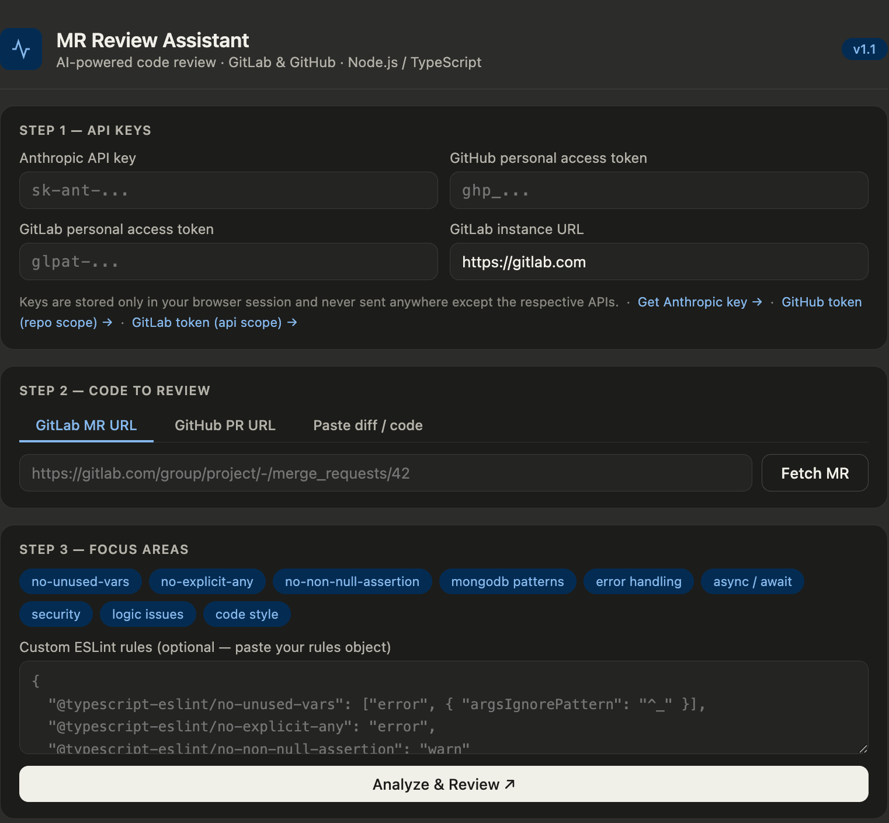

# MR Review Assistant

> AI-powered merge request / pull request code reviewer for GitLab & GitHub — built for Node.js / TypeScript / MongoDB teams.


---

## What it does

Paste a GitLab MR or GitHub PR URL → get an instant AI-powered code review that checks for:

- **ESLint violations** — based on your TypeScript ESLint config (`no-explicit-any`, `no-unused-vars`, `no-non-null-assertion`, etc.)
- **MongoDB anti-patterns** — missing `.lean()`, missing `await` on queries, no error handling on DB ops, missing field projections
- **Async/await bugs** — unhandled promises, missing `try/catch`, fire-and-forget DB calls
- **Security issues** — hardcoded secrets, NoSQL injection risks, unvalidated inputs
- **Code style violations** — naming conventions, unnecessary complexity, missing return types
- **Logic bugs** — edge cases, incorrect conditions, missing null checks

After reviewing, it can **auto-post the review as a comment** directly on your GitLab MR or GitHub PR.

---

## Screenshot



---

## Getting started

### Requirements

- Node.js **≥ 18.0.0** (uses built-in `fetch`)

### Setup

```bash
# 1. Clone the repo
git clone https://github.com/PriyamSengupta/mr-review-assistant.git
cd mr-review-assistant

# 2. Install dependencies
npm install

# 3. Configure your API keys
cp .env.example .env
# Edit .env and fill in your keys (see below)

# 4. Start the server
npm start
```

Open **http://localhost:3000** in your browser.

> **Dev mode** (auto-restarts on file change):
> ```bash
> npm run dev
> ```

---

## Configuration (.env)

Copy `.env.example` to `.env` and fill in your keys. The file is gitignored and never committed.

```env
# Required for AI review
ANTHROPIC_API_KEY=sk-ant-your-key-here

# Required for GitHub PR reviews (repo scope)
GITHUB_TOKEN=ghp_your-token-here

# Required for GitLab MR reviews (api scope)
GITLAB_TOKEN=glpat-your-token-here

# Optional — change for self-hosted GitLab
GITLAB_HOST=https://gitlab.com

# Optional — default is 3000
PORT=3000
```

| Key | Where to get it | Scope needed |
|-----|----------------|-------------|
| `ANTHROPIC_API_KEY` | [console.anthropic.com/settings/keys](https://console.anthropic.com/settings/keys) | — |
| `GITHUB_TOKEN` | [github.com/settings/tokens](https://github.com/settings/tokens) | `repo` |
| `GITLAB_TOKEN` | [gitlab.com/-/user_settings/personal_access_tokens](https://gitlab.com/-/user_settings/personal_access_tokens) | `api` |

> Keys live only in your `.env` on your machine. They are never exposed to the browser or committed to git.

---

## Usage

### Step 1 — Paste your MR / PR URL

**GitLab MR:**
```
https://gitlab.com/your-group/your-project/-/merge_requests/42
```
Click **Fetch MR** — loads the title, author, branch info, and full diff automatically.

**GitHub PR:**
```
https://github.com/owner/repo/pull/42
```
Click **Fetch PR** — same experience, using the GitHub REST API.

Alternatively, switch to **Paste diff / code** tab and paste a raw git diff or file contents directly.

### Step 2 — Toggle focus areas & Review

Toggle which categories you want to focus on, then click **Analyze & Review**.

Once results appear, click **Post comment on MR / PR** to push the review directly to GitLab or GitHub as a formatted markdown comment.

---

## Sample comment output

```markdown
## ⚠️ AI Code Review — Score: 61/100

> The MR introduces a user deletion endpoint but has several issues...

### Findings

🔴 [no-explicit-any] Parameter `data` is typed as `any` — loses all type safety.
> 💡 Replace with a proper interface: `data: DeleteUserPayload`

🔴 [error-handling] `User.findByIdAndDelete()` is called without `await` and has no try/catch.
```
async function deleteUser(id) {
  User.findByIdAndDelete(id)   // ← missing await + no error handling
}
```
> 💡 Wrap in try/catch and await the call.

🟡 [mongodb-patterns] `.find()` returns full Mongoose documents. Use `.lean()` for read-only queries.
```

---

## Customizing ESLint rules

In **Step 2**, paste your own ESLint rules JSON to override the defaults:

```json
{
  "@typescript-eslint/no-unused-vars": ["error", { "argsIgnorePattern": "^_" }],
  "@typescript-eslint/no-explicit-any": "error",
  "@typescript-eslint/no-non-null-assertion": "warn",
  "@typescript-eslint/explicit-function-return-type": "error"
}
```

---

## Self-hosted GitLab

Set `GITLAB_HOST` in your `.env`:

```env
GITLAB_HOST=https://gitlab.yourcompany.com
```

---

## Project structure

```
mr-review-assistant/
├── server.js         # Express server — proxies all API calls
├── package.json
├── .env              # Your API keys (gitignored, never committed)
├── .env.example      # Template — commit this
└── public/           # Static frontend served by Express
    ├── index.html
    ├── styles.css
    └── app.js
```

---

## Tech stack

- **Node.js + Express** — backend server, keeps all API keys server-side
- **Vanilla HTML/CSS/JS** — zero frontend dependencies, no build step
- **Claude API** (`claude-sonnet-4-20250514`) — AI-powered code analysis
- **GitLab REST API v4** — fetch MR diffs and post review comments
- **GitHub REST API** — fetch PR diffs and post review comments

---

## Roadmap

- [x] GitHub support (PRs)
- [x] Node.js server (API keys never exposed to browser)
- [ ] YouTrack integration — auto-update linked task status after review
- [ ] Inline diff comments (line-level review notes)
- [ ] Custom rule presets — save and reuse your ESLint config
- [ ] Team dashboard — review history and quality trends

---

## Contributing

PRs welcome! Please open an issue first to discuss what you'd like to change.

---

## License

MIT © [Priyam Sengupta](https://github.com/PriyamSengupta)
